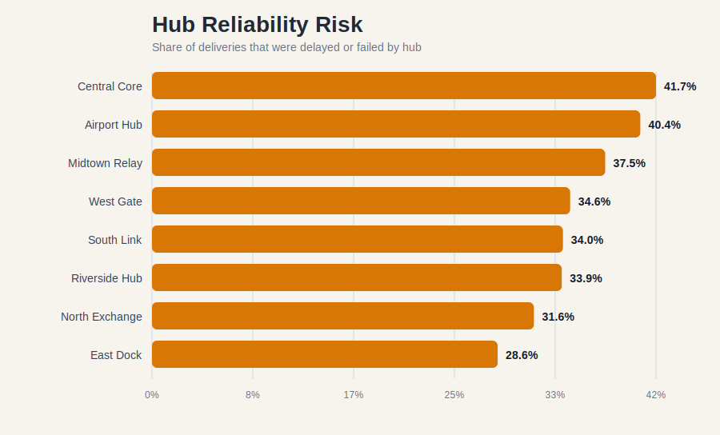
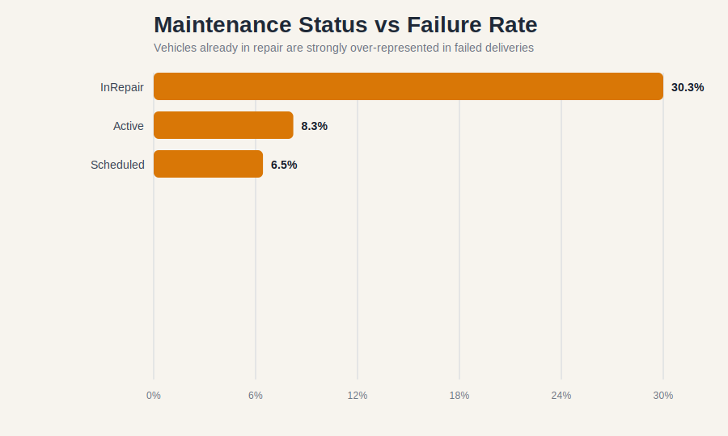

# Databases and Analytics Assignment

Student ID: `[add your student ID before submission]`  
Module: `CP60056E Databases and Analytics`  
Case Study: `NorthStar Urban Mobility and Logistics`

## Executive Summary

This report analyses the NorthStar Urban Mobility and Logistics case study using relational querying, analytics, Python-based feature engineering, and a MongoDB Atlas redesign proposal. The dataset contains `1,250` orders, `950` delivery records, `320` complaints, `280` incidents, and `640` app events. The analysis shows that NorthStar's performance problem is not caused by one isolated bottleneck. It is driven by three connected failures.

First, the company has a fragmented operational pipeline. There are `300` orders with no linked delivery record, which suggests a break between order capture and dispatch visibility. Second, service reliability is uneven across the network. Central hubs are materially weaker than East, with `Central Core` showing `41.7%` non-on-time deliveries and `20.0%` failed deliveries, while `East Dock` performs materially better with `28.6%` non-on-time deliveries and `9.2%` failed deliveries. Third, the business is carrying avoidable service and customer experience risk. Deliveries with missing proof of completion have `65.2%` delayed and `34.8%` failed outcomes, compared with `17.8%` delayed and `12.3%` failed where proof is present.

The evidence also shows that customer dissatisfaction is not explained by delays alone. A large share of complaints are attached to deliveries recorded as `OnTime`, especially for `Delay`, `AppIssue`, `DriverBehaviour`, and `MissedPickup`, which supports the case study claim that operational truth is being split across disconnected systems. App activity data adds a second signal: airport and central event flows show the highest latency, with `Airport track_order` averaging `692.05 ms`, reinforcing the digital experience concern.

The recommended solution is a hybrid model. Structured operational records should stay queryable in relational form for reporting and analytics, while evolving case histories, app interactions, exception chains, and service events should be remodelled into MongoDB Atlas documents. This gives NorthStar a unified view of customers, orders, complaints, incidents, and event histories while also supporting indexing, operational queries, and scalable analytics.

## 1. Data Understanding and Preparation

The provided dataset contains the following files:

- `orders.csv` for service requests across passenger, parcel, retail, business, and medical work.
- `deliveries.csv` for dispatch outcomes, route overrides, proof-of-completion flags, and direct operating cost.
- `customers.csv`, `drivers.csv`, `vehicles.csv`, and `hubs.csv` for master and operational reference data.
- `complaints.csv`, `incidents.csv`, and `app_events.csv` for experience, exception, and platform evidence.

Before analysis, the main data quality issues were normalised:

- zone labels were inconsistent, for example `North`, `NORTH`, `north`, `Central`, `CENTRAL`, and `Ctr`
- some categorical values were blank, including `25` missing booking channels and `13` missing preferred channels
- `19` deliveries had no completion timestamp and `14` had no post-delivery rating
- `300` orders did not join to any delivery record

These issues matter because the assignment asks for evidence-led decisions. Without standardising zones and join keys, location comparisons and cross-file analysis would be unreliable.

Supporting files created during this work:

- [dataset_quality_summary.csv](../artifacts/outputs/dataset_quality_summary.csv)
- [hub_risk_summary.csv](../artifacts/outputs/hub_risk_summary.csv)
- [zone_performance_summary.csv](../artifacts/outputs/zone_performance_summary.csv)

## 2. SQL in R Analytics

The relational part of the solution was designed to answer the board's core operational questions:

1. Where are reliability failures concentrated?
2. Where is the order-to-dispatch pipeline breaking down?
3. Which hubs and service contexts combine poor service with weaker commercial outcomes?

### 2.1 Example SQL in R Approach

The structured files can be loaded into an in-memory SQLite database from R and queried with `DBI` and `RSQLite`. A representative query is shown below.

```r
hub_risk <- dbGetQuery(con, "
SELECT
    h.hub_name,
    h.zone_clean,
    COUNT(*) AS deliveries,
    ROUND(100.0 * SUM(CASE WHEN d.delivery_status != 'OnTime' THEN 1 ELSE 0 END) / COUNT(*), 1) AS non_ontime_pct,
    ROUND(100.0 * SUM(CASE WHEN d.delivery_status = 'Failed' THEN 1 ELSE 0 END) / COUNT(*), 1) AS failed_pct,
    ROUND(AVG(d.manual_route_override_count), 2) AS avg_route_overrides
FROM vw_deliveries d
JOIN vw_hubs h ON h.hub_id = d.hub_id
GROUP BY h.hub_name, h.zone_clean
ORDER BY non_ontime_pct DESC, failed_pct DESC
")
```

This type of query is efficient because it performs grouping in the database layer and returns only the result set required for interpretation and visualisation.

### 2.2 Key SQL Findings

The strongest relational findings are:

- `300` of `1,250` orders have no delivery record, which indicates process fragmentation between order capture and dispatch execution.
- The missing orders are not concentrated in one service type only: `Passenger 79`, `Parcel 78`, `Retail 73`, `Business 39`, and `Medical 31`.
- `Central Core` has the highest non-on-time share at `41.7%`, followed by `Airport Hub` at `40.4%` and `Midtown Relay` at `37.5%`.
- At zone level, `Central` is weakest overall with only `60.5%` on-time delivery and `20.2%` failed delivery.

This makes the operations director's concern about route allocation and underperforming hubs credible, especially in the central network.



### 2.3 Interpretation

The SQL results suggest the business is not simply experiencing random noise. It has a structural reliability problem in the central operating layer, and that weakness is happening at the same time as significant dispatch invisibility. That combination is especially risky because managers cannot improve what the reporting model cannot fully see.

## 3. R Analytics

R analytics was used conceptually to move from operational reporting to explanatory analysis. The strongest analytical patterns are summarised below.

### 3.1 Complaint and Experience Analysis

Complaints are not only attached to obviously failed deliveries:

- `Delay` complaints occur `44` times on deliveries recorded as `OnTime`, `19` on `Delayed`, and `10` on `Failed`.
- `AppIssue` complaints occur `25` times on `OnTime` deliveries.
- `DriverBehaviour` complaints occur `29` times on `OnTime` deliveries.
- `MissedPickup` complaints occur `25` times on `OnTime` deliveries.

This is an important business finding. It means NorthStar's current operational status values do not fully represent customer experience. An order can be operationally closed but still produce dissatisfaction, compensation cost, and repeat contact.

### 3.2 Hub-Level Customer Experience

Complaint pressure is highest at:

- `Riverside Hub`: `0.287` complaints per delivery
- `East Dock`: `0.277`
- `Midtown Relay`: `0.273`
- `Central Core`: `0.261`

`South Link` is the best of the hubs at `0.170` complaints per delivery. This matters because high complaint load is not perfectly aligned with failure rate alone, again showing that service quality is broader than late versus failed completion.

### 3.3 Digital Experience Signal

The app event data shows elevated latency in the airport and central zones:

- `Airport track_order`: `692.05 ms`
- `Airport chat_opened`: `656.15 ms`
- `Airport eta_refresh`: `562.60 ms`
- `Central chat_opened`: `526.79 ms`
- `Central payment_retry`: `520.00 ms` with only `90.0%` success
- `South payment_retry`: `479.64 ms` with `72.7%` success

These patterns help explain why customer complaints can remain high even when operational status appears acceptable. Platform friction is part of the service problem.

Supporting evidence:

- [complaints_by_hub.csv](../artifacts/outputs/complaints_by_hub.csv)
- [complaint_mix_by_delivery_status.csv](../artifacts/outputs/complaint_mix_by_delivery_status.csv)
- [app_event_latency_summary.csv](../artifacts/outputs/app_event_latency_summary.csv)

## 4. Python Data Processing and Analysis

Python was used to clean categorical inconsistencies, engineer analytical features, and connect datasets across customers, orders, deliveries, complaints, incidents, and assets.

### 4.1 Feature Engineering

The most useful engineered features were:

- `zone_clean` to standardise location categories
- `completion_hours` from dispatch to completion
- grouped route-override bands
- joined profitability proxy using `order_value - fuel_or_charge_cost - compensation_amount`
- outcome-risk flags such as missing proof of completion

### 4.2 Operational Risk Findings

Two findings are especially strong.

First, route overrides are associated with weaker results:

- `0` overrides: `31.1%` non-on-time, average rating `3.90`
- `1` override: `38.1%` non-on-time, average rating `3.88`
- `3+` overrides: `40.9%` non-on-time, average rating `3.70`

Second, missing proof of completion is an extremely strong warning signal:

- proof present: `17.8%` delayed, `12.3%` failed, average rating `3.92`
- proof missing: `65.2%` delayed, `34.8%` failed, average rating `3.17`



### 4.3 Asset and Maintenance Findings

Vehicle maintenance status is one of the clearest asset-side predictors of failure:

- `InRepair` vehicles: only `49.2%` on-time and `30.3%` failed
- `Active` vehicles: `70.8%` on-time and `8.3%` failed
- `Scheduled` vehicles: `69.5%` on-time and `6.5%` failed

This strongly supports the case study's suggestion that fault and scheduling data are not being used together effectively enough. If vehicles already marked `InRepair` still appear in delivery execution at this scale, the organisation has a resource allocation control problem.

### 4.4 Commercial View

Using direct delivery cost plus compensation as a simple profitability proxy, the weakest hubs are:

- `Airport Hub`: average net after compensation `68.34`
- `Riverside Hub`: `70.69`
- `Midtown Relay`: `71.00`

The strongest are:

- `Central Core`: `80.98`
- `East Dock`: `80.82`

This does not mean Central is healthy overall. It means Central carries high revenue per order but still underperforms operationally. That is exactly the kind of contradiction the finance director described: a segment can look commercially large while still being service-fragile and expensive to run.

Supporting files:

- [route_override_summary.csv](../artifacts/outputs/route_override_summary.csv)
- [proof_missing_summary.csv](../artifacts/outputs/proof_missing_summary.csv)
- [vehicle_maintenance_summary.csv](../artifacts/outputs/vehicle_maintenance_summary.csv)
- [profitability_by_hub.csv](../artifacts/outputs/profitability_by_hub.csv)

## 5. MongoDB Atlas Database Design

The case study explicitly states that NorthStar now produces nested and evolving records such as app interactions, complaint histories, route exceptions, incident chains, and case-level conversations. These are poor fits for a rigid relational model because their structure varies over time and because the most important business questions require event histories to stay together.

### 5.1 Recommended Collections

I recommend the following MongoDB Atlas design:

1. `customer_cases`
   One document per operational case or order-centric customer issue. This document embeds customer summary data, linked order data, complaint history, app interaction history, and operational exception events.

2. `service_orders`
   One document per order containing service details, dispatch summary, and lightweight references to related delivery and hub records.

3. `delivery_events`
   One document per delivery with embedded event timeline, override actions, proof records, and incident snapshots.

4. `asset_health`
   One document per vehicle with maintenance state, battery history, and recent delivery linkage.

### 5.2 Example `customer_cases` Document

```json
{
  "_id": "CASE_O00814",
  "order_id": "O00814",
  "customer": {
    "customer_id": "C0464",
    "home_zone": "North",
    "customer_type": "Consumer",
    "loyalty_score": 58.4
  },
  "service_order": {
    "service_type": "Passenger",
    "pickup_zone": "Central",
    "dropoff_zone": "Airport",
    "priority_level": "High",
    "order_value": 94.50,
    "booking_channel": "App"
  },
  "delivery_summary": {
    "delivery_id": "DL00481",
    "hub_id": "H04",
    "hub_name": "Central Core",
    "delivery_status": "Delayed",
    "manual_route_override_count": 2,
    "proof_of_completion_missing": false
  },
  "complaints": [
    {
      "complaint_id": "CP0001",
      "complaint_type": "AppIssue",
      "severity": "High",
      "status": "Open",
      "compensation_amount": 23.99,
      "created_at": "2025-03-30T02:36:00Z"
    }
  ],
  "app_events": [
    {
      "event_id": "AE00999",
      "event_type": "track_order",
      "event_timestamp": "2025-03-29T22:16:00Z",
      "api_latency_ms": 611,
      "success_flag": true
    }
  ],
  "incident_events": [
    {
      "incident_id": "I0104",
      "incident_type": "RouteDeviation",
      "severity": "Medium",
      "resolved_hours": 10.2
    }
  ],
  "case_status": "Open"
}
```

### 5.3 Why This Design Fits the Case

This design solves three problems at once:

- it keeps related case history together for fast operational review
- it supports flexible nested arrays for app events, complaints, and exception sequences
- it gives managers one document-level view of customer experience rather than splitting evidence across multiple systems

## 6. Query Optimisation Strategy

### 6.1 Relational Optimisation

For the structured analytics workload, the most useful relational indexes would be:

```sql
CREATE INDEX idx_orders_customer ON orders(customer_id);
CREATE INDEX idx_orders_service_type ON orders(service_type);
CREATE INDEX idx_deliveries_order ON deliveries(order_id);
CREATE INDEX idx_deliveries_hub_status ON deliveries(hub_id, delivery_status);
CREATE INDEX idx_complaints_order ON complaints(order_id);
CREATE INDEX idx_app_events_customer_timestamp ON app_events(customer_id, event_timestamp);
```

These support the exact joins and filters used repeatedly in the analysis, especially order-to-delivery matching, hub performance aggregation, complaint linkage, and app-event timelines.

### 6.2 MongoDB Atlas Indexing

For MongoDB, the recommended indexes are:

```python
customer_cases.create_index([("order_id", 1)], unique=True)
customer_cases.create_index([("customer.customer_id", 1), ("case_status", 1)])
customer_cases.create_index([("delivery_summary.hub_id", 1), ("delivery_summary.delivery_status", 1)])
customer_cases.create_index([("complaints.status", 1), ("complaints.severity", 1)])
customer_cases.create_index([("app_events.event_timestamp", -1)])

delivery_events.create_index([("delivery_id", 1)], unique=True)
delivery_events.create_index([("vehicle_id", 1), ("maintenance_status", 1)])
delivery_events.create_index([("event_timeline.event_type", 1), ("event_timeline.event_timestamp", -1)])
```

These indexes support the queries NorthStar is most likely to run:

- all open high-severity customer cases
- all delayed or failed cases by hub
- recent event histories for a customer or order
- delivery exceptions by vehicle or incident pattern

### 6.3 Explain-Plan Logic

The coursework brief asks for optimisation justification. In MongoDB Atlas, this should be demonstrated with `explain("executionStats")` before and after index creation to show:

- lower document scans
- lower keys examined
- lower execution time
- index usage replacing collection scans

The strongest candidate demonstration query is:

```python
db.customer_cases.find(
    {
        "delivery_summary.hub_id": "H04",
        "delivery_summary.delivery_status": {"$in": ["Delayed", "Failed"]},
        "case_status": "Open"
    }
).explain("executionStats")
```

Without a compound index this would be expensive at scale. With the recommended index strategy, the query becomes operationally viable for a live dashboard or case-management workflow.

## 7. Recommendations

NorthStar should act in the following order:

1. Fix the order-to-delivery control gap. The `300` orders with no linked delivery record are too large to ignore and should be investigated as backlog, cancellation, or missing integration cases.
2. Prioritise central operations. `Central Core` and `Midtown Relay` need immediate review of dispatch planning, staffing, and exception handling.
3. Treat missing proof of completion as a formal risk trigger. It is strongly associated with poor outcomes and low ratings.
4. Stop routing active deliveries through vehicles already marked `InRepair` unless a validated operational exception exists.
5. Build a unified case-management view in MongoDB Atlas so customer complaints, app signals, and operational events can be analysed together rather than in separate systems.
6. Monitor airport and central digital latency as part of service quality, not just as a technical metric.

## Conclusion

The NorthStar case is fundamentally a data integration and operational visibility problem. The dataset shows a company collecting enough information to diagnose failure, but not modelling or connecting it well enough to act decisively. SQL in R is suitable for structured operational analysis, R analytics is useful for trend and experience interpretation, Python adds strong cross-file cleaning and feature engineering, and MongoDB Atlas is the right target for nested case histories and fast-changing event data.

The final recommendation is therefore not a single tool, but an integrated analytics architecture. NorthStar should retain relational analytics for structured reporting, introduce Python-led data quality controls, and redesign customer case and exception histories into MongoDB Atlas. That approach best addresses the operational, customer, and decision-making failures described in the case study.
